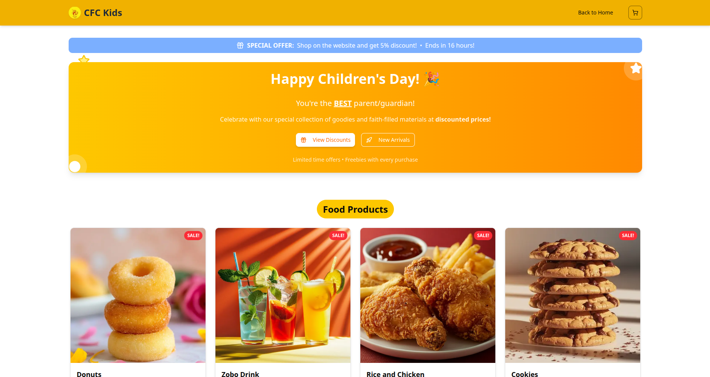

# CFC Kids Ministry Website

Welcome to the official website for **CFC Kids Ministry** ([cfckids.com.ng](https://cfckids.com.ng)). This is a modern, full-featured site for our vibrant kids ministry, featuring an interactive landing page and a powerful mini e-commerce solution tailored for our community.

---

## 🧒 About CFC Kids

The CFC Kids Ministry site supports our mission to nurture, educate, and connect children within our ministry. The landing page highlights our story, instructors, event gallery, and gives parents a way to reach out. The integrated shop empowers our kids and team to sell creative products, with seamless orders and secure payments.

---

## ✨ Features

- **Landing Page**  
  - Hero section introducing the ministry
  - About us, instructors, gallery, events, and contact sections

- **Shop Page**  
  - Mini e-commerce experience with:
    - Product listing (powered by Sanity CMS)
    - Cart management
    - Secure payments via Paystack
    - Order success page with automatic route back to shop

- **Order Management**  
  - Orders are automatically recorded in Sanity
  - Dedicated orders/admin page for easy order management

- **CMS Integration**  
  - All site content (pages, products, gallery, events) managed via Sanity.io

- **Deployment**  
  - Live and production-ready: [cfckids.com.ng](https://cfckids.com.ng) (hosted on Vercel)

---

## 🛠️ Tech Stack

- **Next.js** (React framework)
- **Sanity.io** (Headless CMS for content and products)
- **Paystack** (Payment gateway integration)
- **Vercel** (Hosting & deployment)

---

## 🚀 Getting Started

**Clone the repository:**
```bash
git clone https://github.com/NiengeDavid/cfc-kids.git
cd cfc-kids
```

**Install dependencies:**
```bash
npm install
# or
yarn install
```

**Set up environment variables:**  
Create a `.env.local` file with the following (example):
```
NEXT_PUBLIC_SANITY_PROJECT_ID=your_sanity_project_id
NEXT_PUBLIC_SANITY_DATASET=production
SANITY_API_TOKEN=your_sanity_token
NEXT_PUBLIC_PAYSTACK_KEY=your_paystack_public_key
# ...any other required variables
```

**Start the development server:**
```bash
npm run dev
```
Visit [http://localhost:3000](http://localhost:3000) in your browser.

---

## 🖥️ Demo

- **Live Site:** [cfckids.com.ng](https://cfckids.com.ng)

Feel free to explore the landing page and try out the shop!

---

## 🛒 E-commerce Details

- Product data and inventory managed via Sanity CMS
- Secure payments handled by Paystack (test/live keys can be configured)
- Each order is automatically created in Sanity for admin review and fulfillment
- Admins can view/manage all orders via the `/orders` page (admin access required)

---

## 🖼️ Screenshots

<!-- Add screenshots here when available -->
<!-- Example:


-->

---

## 📝 Contributing

We welcome contributions to improve the CFC Kids website!  
To contribute:

1. Fork this repository
2. Create a new branch (`git checkout -b feature/your-feature`)
3. Commit your changes (`git commit -am 'Add new feature'`)
4. Push to the branch (`git push origin feature/your-feature`)
5. Open a Pull Request

---

## 📄 License

This project is licensed under the MIT License.

---

## 🙏 Acknowledgements

- [Next.js](https://nextjs.org/)
- [Sanity.io](https://www.sanity.io/)
- [Paystack](https://paystack.com/)
- [Vercel](https://vercel.com/)

---

> CFC Kids Ministry • [cfckids.com.ng](https://cfckids.com.ng)
